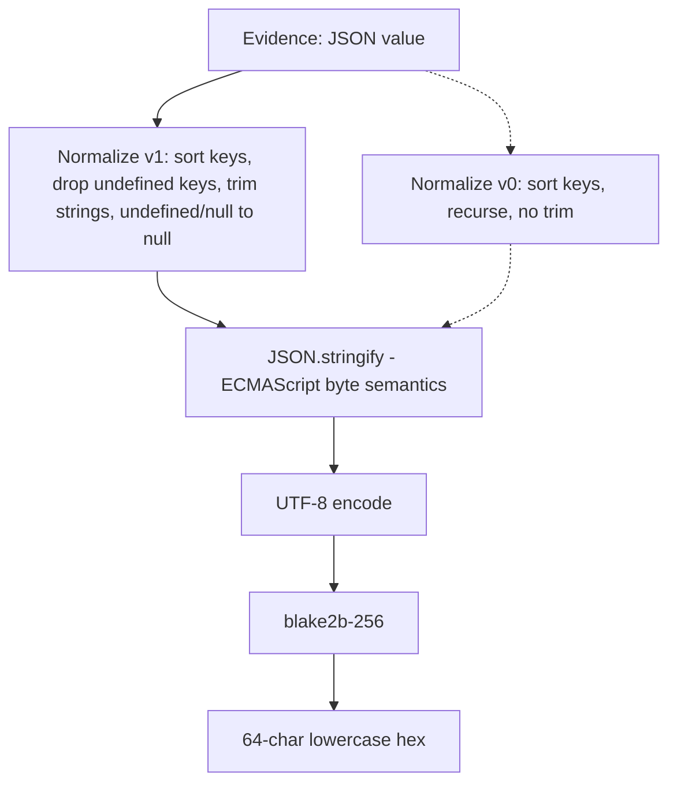
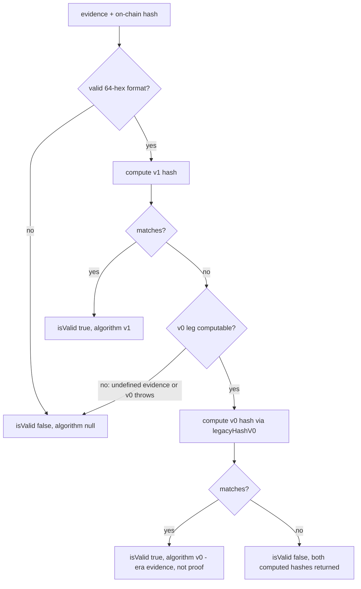

# Canonical-v1 Commitment Hash - Plan

## Goal Capsule

- **Objective:** Bless `computeCommitmentHash` as the canonical-v1 evidence hasher: frozen spec, first tests plus golden vectors, a documented supported verifier, a deprecated `legacyHashV0` for era-aware verification, and 0.4.0 release prep. GitHub issue #9 is the product authority.
- **Hard constraint:** Zero behavior change to `computeCommitmentHash`. The spec documents what the code already does; golden vectors pin it. Any diff that changes a produced hash is a defect, not a spec edit.
- **Authority hierarchy:** Issue #9 governs product scope; this plan governs implementation; repo conventions (vitest colocated tests, `@deprecated` JSDoc aliases) govern style.
- **Stop conditions:** Stop if any existing hash output changes under the new tests, or if faithful porting of the app-v2 legacy hasher proves impossible to pin down (its repo is read-only reference material).
- **Execution profile:** `npm run typecheck`, `npm test` (vitest), `npm run build` (tsup). No lint script and no PR CI exist in this repo.
- **Tail ownership:** The calling pipeline owns commit/PR. Git tag `v0.4.0` and `npm publish` are manual post-merge steps and are out of this plan's executable scope.

---

## Product Contract

### Summary

Two evidence-hash implementations coexisted: this package's `computeCommitmentHash` trims strings during normalization; `andamio-app-v2`'s parallel hasher does not. Verifiers that used the non-trimming variant reported false corruption against rows hashed by this package. All 43 production `TaskCommitmentV2` rows verify under this package's algorithm, so it is already the de facto canonical hash. This work makes that official: spec it, test it, freeze it, expose the legacy variant for era-aware verifiers, and prepare release 0.4.0. No algorithm change.

### Problem Frame

`src/utils/hashing/commitment-hash.ts` has zero tests on `main` and no written spec. A cross-language parity test exists only on the unmerged `test/commitment-hash-parity-vector` branch. A Go server-side verifier is planned in another repo; without a frozen spec and cross-implementation vectors, that reimplementation will drift exactly the way app-v2's did. The non-trimming algorithm is not only historical: app-v2's assignment commit and update paths still hash with it today (`use-assignment-workflow.ts` calls `hashNormalizedContent`) and will until Andamio-Platform/andamio-app-v2#832 lands, so the v0 row set is still growing and shipping this plan does not by itself end false-corruption reports on assignment rows. Era-aware verifiers need v0 available without reimplementing it.

### Requirements

**Spec and documentation**

- R1. Canonical-v1 spec text lives in the repo and describes an algorithm byte-identical to the current `computeCommitmentHash`: recursively trim strings, drop `undefined`-valued object keys, map `undefined`/`null` to `null`, sort object keys; then `JSON.stringify`, UTF-8 encode, blake2b-256, lowercase hex. The spec declares the algorithm frozen: any behavioral change is a new version, never an edit.
- R2. `verifyCommitmentHash` is documented as the one supported verifier and covered by tests.

**Tests and vectors**

- R3. The `test/commitment-hash-parity-vector` branch content is merged; `commitment-hash.ts` is covered by tests.
- R4. Golden vectors cover the six divergent document shapes — boundary-whitespace text runs, code blocks (leading indent, trailing newline), empty paragraphs, whitespace-only paragraphs, tables, unicode — all passing against `computeCommitmentHash`. Synthetic documents only, no production content.

**Legacy variant**

- R5. The non-trimming app-v2 variant is exported as `legacyHashV0`, marked deprecated, so era-aware verifiers can try both algorithms without reimplementing. Assignment-table rows with boundary whitespace verify only under it. Its deprecation note and the spec's v0 appendix state that v0 remains app-v2's active assignment write path until app-v2#832 lands — a growing row set, not a closed era.

**Release**

- R6. Release prep for 0.4.0 lands in the PR: version bump and CHANGELOG. Publishing is a post-merge human step.

### Scope Boundaries

- **Out of scope — other repos.** The Go twin test in `andamio-cli` and app-v2's migration to this package are separate work in other repositories. This plan only writes the contract (spec plus fixture) those repos will consume.
- **Out of scope — publish actions.** `git tag v0.4.0`, GitHub release creation, and `npm publish` are manual post-merge steps (all prior releases were manual publishes; the release-triggered workflow has never run).

**Deferred to Follow-Up Work**

- Update `andamio-cli`'s Go implementation to consume the vector fixture and fix its `json.Marshal` HTML-escaping divergence (see KTD1); its parity test is expected to fail against the new vectors until then — that failure is the contract working.
- Empirically confirm which production assignment-table rows verify only under v0 (requires DB access from another repo; issue #9 asserts such rows exist).

### Open Questions

- Deferred: does any production row verify only under `legacyHashV0`? Issue #9 asserts yes; v0 and v1 coincide on all documents without boundary whitespace. The answer — and any v0 retention timeline — cannot be settled until andamio-app-v2#832 ends v0 writes; neither changes this plan's scope.

---

## Planning Contract

### Assumptions

Made without user confirmation (headless run); each is reversible in review:

- The spec is a dedicated doc at `docs/specs/commitment-hash-v1.md` with a README section linking to it, rather than README-only. Issue #9 allowed either; a frozen contract deserves a stable standalone home, and the README is already stale in unrelated ways.
- Golden vectors live in a language-neutral JSON fixture rather than hand-mirrored test literals, because the existing single vector is already duplicated by hand into a Go twin with a comment pleading for manual sync.
- An era-aware verify helper is exported alongside `legacyHashV0`. Issue #9's stated purpose — "era-aware verifiers can try both algorithms without reimplementing" — is best served by one shared helper instead of three consumers each writing their own try-both logic.
- CHANGELOG gets backfilled 0.3.0 and 0.3.1 entries (it currently stops at 0.2.0) so the 0.4.0 entry doesn't sit on a gap.
- A minimal PR test workflow is in scope (U6) — a review-driven addition beyond issue #9's six listed changes: without CI, the freeze declaration's "any hash change is a defect" gate has no automated enforcement in this repo.

### Key Technical Decisions

- KTD1. **Serialization is normatively ECMAScript `JSON.stringify`.** The spec pins the byte behavior: minimal escaping, no HTML escaping (`<`, `>`, `&` stay raw), raw U+2028/U+2029, shortest round-trip number form. Rationale: `andamio-cli`'s Go twin uses `json.Marshal`, which HTML-escapes — the two sides agree on the one existing vector only because it contains none of those characters. The spec must name the winner, and vectors must include adversarial characters (`<`, `&`, `"`, backslash, U+2028) so a diverging port fails loudly. The spec includes Go guidance: `json.Encoder` with `SetEscapeHTML(false)`.
- KTD2. **"Trim" is defined by enumerating the ECMAScript whitespace set, and canonical-v1 performs no Unicode normalization.** JS `trim` and Go `strings.TrimSpace` disagree on U+FEFF and U+0085, so the spec lists the exact code points; whitespace vectors include U+00A0, U+FEFF, U+0085, U+3000. `task-hash.ts` applies NFC, so the spec states explicitly that commitment hashing does not, and a composed/decomposed vector pair asserts the hashes differ. Rationale: both are exactly the class of silent cross-implementation divergence that caused the original incident (see `docs/solutions/logic-errors/hash-algorithm-mismatch-cbor-encoding.md`).
- KTD3. **The spec's input domain is JSON values** — anything obtainable from `JSON.parse`, matching the real hash-at-write flow. Behavior on Dates, bigints, `NaN`, and functions is out-of-contract. Rationale: the function signature accepts `unknown`, but non-JSON inputs behave accidentally (a `Date` normalizes to `{}`) and are unrepresentable in Go, making a wider spec unimplementable. The spec separates portability from mutability: only JSON values are guaranteed cross-implementation, but the reference implementation's observable behavior on all inputs — out-of-contract ones included — is frozen too; changing what a `Date` hashes to is a new version, never an edit.
- KTD4. **Vectors are one JSON fixture** at `src/utils/hashing/vectors/commitment-hash-vectors.json`, entries shaped `{description, input, canonicalJson, v1Hash, v0Hash?}`. The vitest suite loops over it (the `ON_CHAIN_VECTORS` array-loop pattern from `task-hash.test.ts`); future reimplementations load the same file (`package.json` `files` already ships `src`). `canonicalJson` — the exact normalized serialization — is included so a mismatching port can tell whether normalization or serialization diverged. `v1Hash` values are generated from the current `computeCommitmentHash` and frozen as literals — their external ground truth is the 43/43 production verification and the existing cross-language parity vector. `v0Hash` values are never generated from the new port: run app-v2's actual `src/lib/hashing.ts` against the fixture inputs in a one-off scratch script, freeze those outputs, and record that provenance in the fixture — the port's tests then validate the port against the original algorithm rather than against itself.
- KTD5. **`legacyHashV0` is a faithful port of app-v2's `normalizeContentStructure` pipeline, differing from it only where the original crashes.** Sort keys, recurse, do not trim, do not explicitly drop `undefined`-valued keys (`JSON.stringify` drops them), UTF-8 encode, blake2b-256, lowercase hex. The one observable divergence from canonical-v1 is trimming, so v0 = v1 for any document with no boundary whitespace — the spec states that a matched algorithm is evidence, not proof, of era. Top-level `undefined` throws a descriptive error (the app-v2 original crashes on `Buffer.from(undefined)`; a deliberate throw per the `task-hash.ts` validation convention is the only permitted difference). Deprecation via the repo's established `@deprecated` JSDoc const/function convention.
- KTD6. **One era-aware verifier:** `verifyEvidenceAgainstEras(evidence, onChainHash)` returning `{isValid, algorithm: "v1" | "v0" | null, computedHashes, message}`, extending the existing `verifyEvidenceDetailed` result-object pattern. Tries v1 first, then v0. Its docblock carries the v0/v1-coincidence caveat from KTD5. The v0 leg is guarded: when evidence is `undefined` or the v0 computation throws, the verifier skips v0 and returns `{isValid: false, algorithm: null}` with only the v1 hash in `computedHashes` — supported verifiers never throw.
- KTD7. **The freeze covers the aliases.** `computeAssignmentInfoHash`, `verifyAssignmentInfoHash`, and `isValidAssignmentInfoHash` alias the canonical functions, so canonical-v1 freezes their behavior too; 0.4.0 is a minor bump and keeps them.

### High-Level Technical Design

Canonical-v1 pipeline and where v0 diverges:

Era-aware verification flow:

---

## Implementation Units

### U1. Merge the parity-vector test branch

- **Goal:** Land `commitment-hash.test.ts` from the unmerged branch so `commitment-hash.ts` gets its existing test coverage, including the cross-language parity vector mirrored in `andamio-cli`.
- **Requirements:** R3
- **Dependencies:** none
- **Files:** `src/utils/hashing/commitment-hash.test.ts` (new, via merge)
- **Approach:** Merge `origin/test/commitment-hash-parity-vector` (single commit, adds only the test file; merge-base analysis shows no conflict is possible — `main` moved only in `package.json` version and docs). Do not rewrite the tests; later units build on them.
- **Test scenarios:**
  - Full suite passes: the 57 existing tests plus the branch's commitment-hash tests (parity vector, determinism, key-order independence, `verifyCommitmentHash` happy/sad/case-insensitive, `isValidCommitmentHash` boundaries, `normalizeForHashing` contract).
- **Verification:** `npm test` green with `commitment-hash.test.ts` included in the run.

### U2. Golden-vector fixture for the divergent shapes

- **Goal:** Pin canonical-v1 byte behavior with a language-neutral vector fixture covering every shape that exposed the algorithm split, plus the adversarial cases from KTD1/KTD2.
- **Requirements:** R4, R1 (byte-identity evidence)
- **Dependencies:** U1
- **Files:** `src/utils/hashing/vectors/commitment-hash-vectors.json` (new), `src/utils/hashing/commitment-hash.test.ts` (modify)
- **Approach:**
  1. Create the fixture with entries per KTD4, synthetic Tiptap documents only.
  2. Migrate the branch's inline cross-language vector to fixture entry 1, preserving the comment pointing at its Go twin.
  3. Add a loop test over the fixture following the `ON_CHAIN_VECTORS` pattern in `task-hash.test.ts`, asserting both `v1Hash` and `canonicalJson` (via `JSON.stringify(normalizeForHashing(input))`).
  4. Generate hash values by running the current implementation, then freeze them as fixture literals.
- **Execution note:** These are characterization vectors — generated from the implementation, then treated as immutable. Comment deliberate-looking-wrong behaviors (trimming inside code blocks, no NFC) in the fixture descriptions so future "fixes" are deterred, mirroring the CBOR-chunking precedent.
- **Test scenarios:**
  - One fixture entry per issue shape: text runs with boundary whitespace (bold/italic/link splits producing runs like `"hello "`), code block with leading indent and trailing newline, empty paragraph, whitespace-only paragraph, table, unicode text.
  - Whitespace-set probes: strings bounded by U+00A0, U+FEFF, U+0085, U+3000 (pins the exact trim set per KTD2).
  - Unicode normalization probe: composed vs decomposed forms of the same visible text hash differently (no NFC).
  - Serialization probes: strings containing `<`, `>`, `&`, `"`, backslash, control chars, U+2028 (pins no-HTML-escaping per KTD1).
  - Number-form probes: attrs carrying an integer, a non-integer float, and values on both sides of the exponent-notation thresholds (e.g., 1e-7, 1e21), pinning ECMAScript number serialization where Go's default formatting diverges (two-digit exponents, `-0` handling).
  - Every entry's `canonicalJson` round-trips: `computeCommitmentHash(JSON.parse(canonicalJson))` equals `v1Hash` (normalization is idempotent).
- **Verification:** All fixture-driven tests pass; no existing test changed.

### U3. `legacyHashV0` and the era-aware verifier

- **Goal:** Export the non-trimming legacy algorithm as a deprecated function and give consumers one supported try-both verifier.
- **Requirements:** R5, R2
- **Dependencies:** U1 (builds on the merged test file), U2 (adds `v0Hash` to the fixture)
- **Files:** `src/utils/hashing/commitment-hash.ts` (modify), `src/utils/hashing/index.ts` (modify — explicit named re-exports, no wildcard there), `src/utils/hashing/commitment-hash.test.ts` (modify), `src/utils/hashing/vectors/commitment-hash-vectors.json` (modify)
- **Approach:** Implement per KTD5 (`legacyHashV0`) and KTD6 (`verifyEvidenceAgainstEras`); `@deprecated` JSDoc on `legacyHashV0` following the existing alias convention in this file. Add `v0Hash` to fixture entries where it differs from `v1Hash` and to at least one where it coincides; generate every `v0Hash` from app-v2's actual hasher per KTD4. The deprecation note and era-verifier docblock state that v0 is still app-v2's active assignment write path until app-v2#832 lands.
- **Test scenarios:**
  - Divergence: a boundary-whitespace document produces different v0 and v1 hashes; the v0 hash matches a frozen fixture value.
  - Coincidence: a document with no boundary whitespace produces identical v0 and v1 hashes (pins the era-ambiguity property).
  - `verifyEvidenceAgainstEras` returns `algorithm: "v1"` for a v1-hashed doc, `algorithm: "v0"` for a v0-only-hashed doc, `isValid: false` with both computed hashes for a mismatched doc, and format-error result for malformed on-chain hash input (mirroring `verifyEvidenceDetailed`).
  - `verifyEvidenceAgainstEras` with `undefined` evidence returns `{isValid: false, algorithm: null}` with only the v1 hash present, without throwing (guarded v0 leg per KTD6).
  - `verifyCommitmentHash` never throws on malformed `expectedHash` and returns false (pins R2's documented edge behavior).
  - Top-level `undefined` into `legacyHashV0` throws a descriptive error.
- **Verification:** `npm run typecheck` and `npm test` green; new exports visible from `@andamio/core` and `@andamio/core/hashing`.

### U4. Canonical-v1 spec doc and README corrections

- **Goal:** The frozen spec exists in the repo; README points at it and correctly documents the supported verifier.
- **Requirements:** R1, R2
- **Dependencies:** U2, U3 (spec references the final surface and fixture)
- **Files:** `docs/specs/commitment-hash-v1.md` (new), `README.md` (modify), `src/utils/hashing/commitment-hash.ts` (modify — module docblock links the spec)
- **Approach:** Spec contents: normalization rules with the enumerated whitespace code-point set (KTD2); explicit no-Unicode-normalization statement; serialization pinned to ECMAScript `JSON.stringify` with Go implementer guidance (KTD1); input domain (KTD3); the freeze declaration ("FROZEN — any behavioral change is a new version"); a note that a hash carries no algorithm identifier, so era is inferred, never encoded; the tamper-evidence boundary: the hash commits to the parsed JSON value, not the stored bytes — whitespace-boundary edits inside strings, stored-text key order, insignificant whitespace, and duplicate keys (whose handling is parser-dependent) are all invisible to v1, so byte-wise different stored documents can share a hash, and verifiers must render exactly the parsed value they hashed; pointer to the vector fixture as the cross-implementation contract; short v0 appendix (KTD5 semantics plus its divergence/coincidence property). README: add a canonical-v1 section under Hashing linking the spec, document `verifyCommitmentHash` as the supported verifier, and fix the API-table argument-order errors (`verifyTaskHash`/`verifyCommitmentHash` are documented as `(hash, evidence)` but implemented as `(evidence, hash)`).
- **Test scenarios:** Test expectation: none — documentation unit; byte-identity is enforced by U2's vectors.
- **Verification:** Spec statements spot-checked against `commitment-hash.ts` and the fixture; README examples compile against the actual signatures.

### U5. Release prep 0.4.0

- **Goal:** The PR carries everything a maintainer needs to publish 0.4.0 after merge.
- **Requirements:** R6
- **Dependencies:** U1–U4
- **Files:** `package.json` (modify), `package-lock.json` (modify — the 0.3.1 bump forgot it), `CHANGELOG.md` (modify)
- **Approach:** Bump to 0.4.0 in both manifest files (`npm version --no-git-tag-version` keeps them in sync). CHANGELOG: backfill 0.3.0 and 0.3.1 entries from git history, then add 0.4.0 following the existing Keep-a-Changelog format, stating the compatibility guarantee explicitly: no hash output changes; canonical-v1 blesses existing behavior; `legacyHashV0` and `verifyEvidenceAgainstEras` are additive; deprecated aliases retained.
- **Test scenarios:** Test expectation: none — release metadata only.
- **Verification:** `npm run build` and `npm run typecheck` green; `package.json` and `package-lock.json` versions agree.

### U6. Minimal PR test workflow (freeze tripwire)

- **Goal:** The freeze gate runs automatically on every PR instead of relying on locally-run tests.
- **Requirements:** R1 (freeze enforcement), R4
- **Dependencies:** U2
- **Files:** `.github/workflows/test.yml` (new), `src/utils/hashing/commitment-hash.test.ts` (modify)
- **Approach:** One job on pull_request and push-to-main: `npm ci`, `npm run typecheck`, `npm test`. Add a fixture-integrity assertion to the vector loop test (expected entry count and unique entry ids) so silently deleting or truncating vectors fails loudly, not just changing them. Review-driven scope addition — see Assumptions.
- **Test scenarios:**
  - Removing or renaming a fixture entry fails the integrity assertion.
- **Verification:** The workflow runs and passes on this plan's own PR — the PR that lands the freeze is the first one the tripwire protects.

---

## Verification Contract

| Gate | Command | Applies to |
|---|---|---|
| Types | `npm run typecheck` | U3, U5 (and any TS change) |
| Tests | `npm test` (vitest run) | U1–U3; full suite must stay green throughout |
| Build | `npm run build` (tsup) | U3 (export surface), U5 |
| CI | `.github/workflows/test.yml` (npm ci, typecheck, tests) | every PR once U6 lands |

No lint gate exists. U6 adds the repo's first PR CI running the same commands; until it lands, these gates run locally.

The overriding gate: every hash value asserted before this work (the 57 existing tests plus the branch's parity vector) must still pass unmodified. A change to any expected hash literal means canonical-v1 was broken, not respecified.

---

## Definition of Done

- All six issue acceptance criteria satisfied in-repo: spec text present and byte-identical to the implementation (R1); parity branch merged with `commitment-hash.ts` covered (R3); golden vectors for all six divergent shapes passing (R4); `verifyCommitmentHash` documented and tested (R2); `legacyHashV0` exported with deprecation note (R5); 0.4.0 version bump and CHANGELOG in the PR (R6).
- `npm run typecheck`, `npm test`, and `npm run build` all green.
- No pre-existing expected-hash literal modified anywhere in the test suite.
- The PR test workflow (U6) is present and green on this plan's own PR.
- No dead or experimental code left in the diff.
- Publishing (tag `v0.4.0`, `npm publish`) is explicitly handed off as a post-merge step in the PR description.

---

## Sources & Research

- GitHub issue #9 — product authority; includes the production verification result (43/43 rows verify under this algorithm).
- `src/utils/hashing/commitment-hash.ts` — the algorithm being blessed; existing `@deprecated` alias convention.
- Branch `test/commitment-hash-parity-vector` (commit `06b5cf0`) — the existing test file and cross-language vector; twin in `andamio-cli` `cmd/andamio/commitment_hash_parity_test.go` (uses `json.Marshal` — HTML-escaping divergence behind KTD1).
- `andamio-app-v2` `src/lib/hashing.ts` — the legacy non-trimming implementation `legacyHashV0` ports (KTD5); still called from that repo's `use-assignment-workflow.ts` assignment commit/update paths, so v0 is a live writer until app-v2#832 lands.
- `src/utils/hashing/task-hash.test.ts` — the `ON_CHAIN_VECTORS` loop pattern (KTD4) and validation-error conventions.
- `docs/solutions/logic-errors/hash-algorithm-mismatch-cbor-encoding.md` — prior hash-blessing incident; motivates frozen spec, byte-level vector detail, and edge-size probes (KTD1/KTD2).
- `docs/plans/2026-03-19-fix-cbor-byte-string-chunking-plan.md` — precedent for pinning surprising-but-correct behavior in tests to deter future "fixes".
